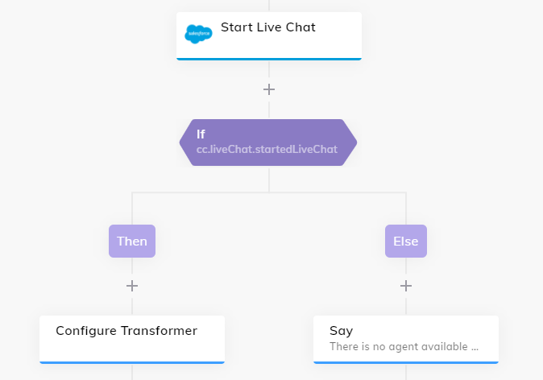

# Salesforce Service Console Live Chat

This transformer is used in order to send messages to an ongoing Salesforce Service Console chat session. Therefore, it will be used together with the [Salesforce Extension](https://github.com/Cognigy/Extensions/tree/master/extensions/salesforce).

## Set Up:

1. Change the `LIVE_AGENT_URL` with your Salesforce Live Agent URL
2. Use the following [Say Node](https://docs.cognigy.com/docs/say-nodes) in your [Flow](https://docs.cognigy.com/docs/flows) in order to configure the transformer:

Text: "" \
Data:
```json
{
    "liveAgentSessionKey": "{{context.liveChat.session.key}}",
    "liveAgentAffinity": "{{context.liveChat.session.affinityToken}}",
    "isHandover": true
}
```

## Example:

The Salesforce Flow in your virtual agent could look like the following where the **Configure Transformer** Node contains the above mentioned Say Node:

