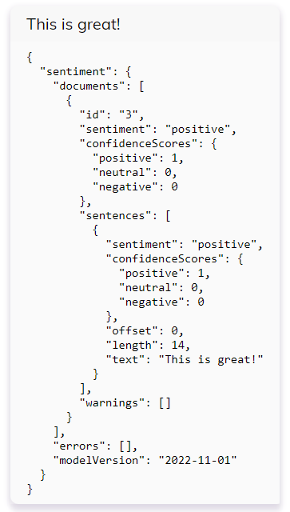

# Description
This transformer example shows how to integrate real time sentiment analysis to every user input using [Microsoft Cognitive Services](https://azure.microsoft.com/en-us/products/cognitive-services/text-analytics)

# Usage
To use this transformer you will need to create a key and find out the region of your Azure Cognitive Services enpoint. Information regarding this can be found [in this document from Microsoft](https://learn.microsoft.com/en-us/rest/api/cognitiveservices-textanalytics/).

After creating the Microsoft Cognitive Services Endpoint, the contents of the ``transformer.ts`` file have to be copied into the Transformer Function of the webchat Endpoint. Afterwards, the ``Input Transformer`` has to be ``enabled``.

You will need to replace with beginning of the ``cognitiveServiceUrl`` with the region of your Cognitive Services endpoint (for example "germanywestcentral", "uswest" etc.). 
The ``cognitiveServiceKey`` will need to be replaced with the key from your Cognitive Services Endpoint.

The sentiment of each user statement will then be added to the data object of the user input.

