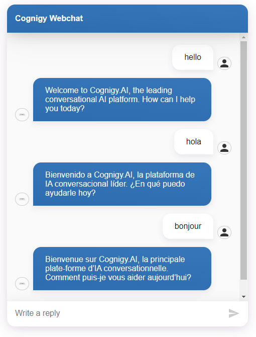
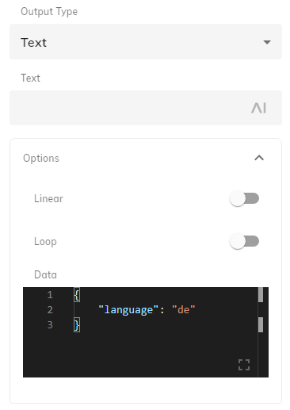

# Realtime Translation Transformer
For the Cognigy Webchat endpoint.

With this Transformer function, Cognigy.AI is able to translate messages that were sent by the user and virtual agent automatically using **Microsoft Translate**, **Google Translate** or **DeepL Translate** API.

## Configuration

- `TRANSLATOR`
  - Which API to use, can be `google` or `microsoft` or `deepl`.
- `TRANSLATOR_API_KEY` 
  - API Key for the `TRANSLATOR`.
- `FLOW_LANGUAGE` -
  - language of the Cognigy.AI Flow. A two-letter code, e.g. 'en', 'de', 'fr'. Read about the supported languages in the API documentation: [Google Translate](https://cloud.google.com/translate/docs/languages), [Microsoft Translate](https://docs.microsoft.com/en-us/azure/cognitive-services/translator/language-support) and [Deepl Translate](https://www.deepl.com/docs-api/translating-text/request/).
  
- `AUTO_DETECT_LANGUAGE` 
  - Should the transformer detect the user anguage automatically. Can be `true` or `false`. Read more below.
- `NO_TRANSLATE_PREFFIX`
  - A prefix text, which is added before the postback of the buttons. Later, when the user clicks on a button, the prefix is automatically removed and the postback text is handled to the flow without being translated.

## Option 1: `AUTO_DETECT_LANGUAGE = true`

The translator detects the user language automatically from their messages. The detected language is then used to translate user messages to the `FLOW_LANGUAGE` and bot messages to the detected user language. The language is stored in the session under `detectedLanguage`. The value is overwritten every time when the user eneters new message. As the result, the user can start talking in one langauge and then switch to another, after which the new language will be used.

**Example:**



## Option 2: `AUTO_DETECT_LANGUAGE = false`

The Cognigy.AI Flow needs to send the preferred language by using a data-only message with the following payload:

```json
{
  "language": "de"
}
```



Since the message doesn't contain a text, it is not displayed in the chat. The transformer intercepts the `language` value and stores it in the session under `language`. This value is then used to translate all bot and user messages until the flow sends another data payload with the new `language` value.

**Important!**

The `language` value must be one of the accepted by the selected `TRANSLATOR`. See `FLOW_LANGUAGE` above for the related documentation links.

## Supported Message Types

The transformer supports the following message types from the bot to the user:

- Text
- Text with Quick Replies
- Text with Buttons
- Gallery
