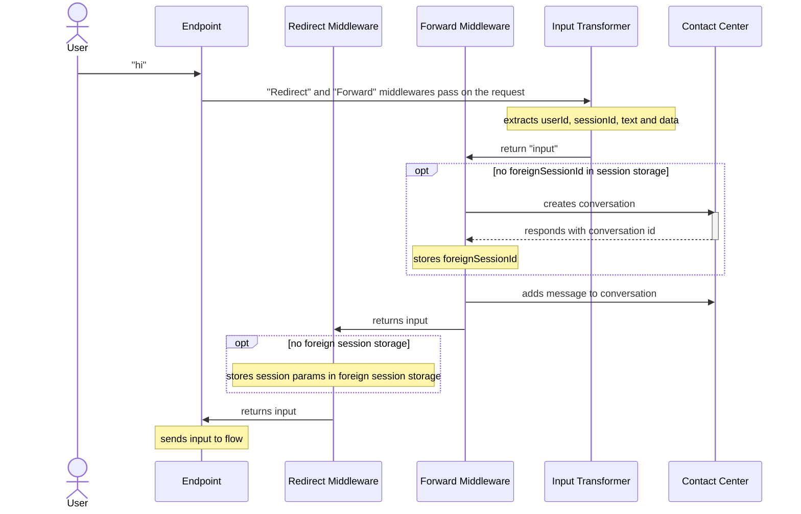
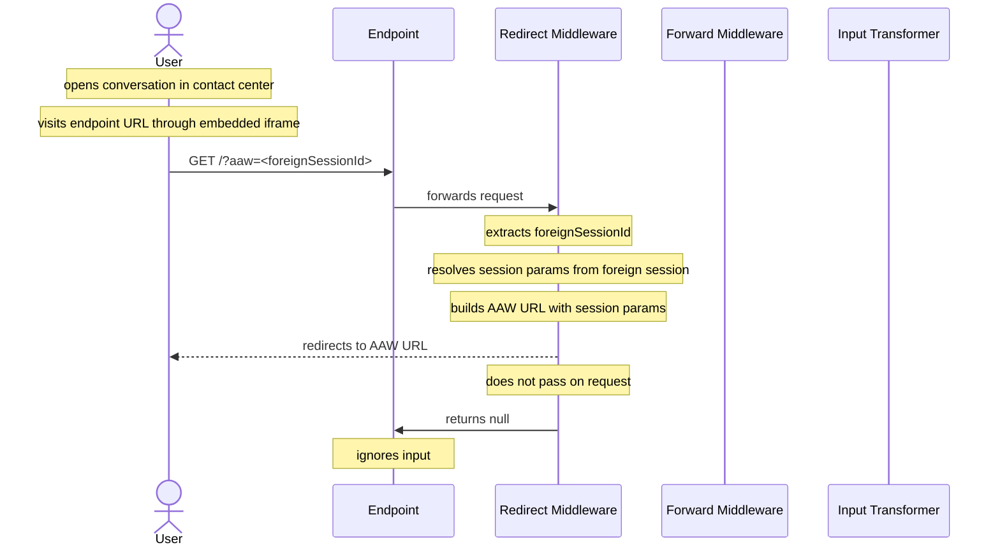

# Custom Handover AAW Redirect

These transformer snippets can be used on top of your regular transformer integration
in order to make it easier to embed the Agent Assist Workspace into a Contact Center.

Because the available resources for dynamic embedding URLs might be limited, we assume that the
contact center is capable of passing its own "conversation id" - from our perspective: a "foreign session id" -
as a query parameter.

For native handover providers, cognigy will always know the foreign session id implicitly, and you may use the
`https://<agent-assist-workspace>/embed/v1?foreignSessionId=<foreign-session-id>` route to embed the Agent Assist Workspace
into your contact center solution.

However, for custom scenarios, this feature is not available out of the box.
This transformer snippet helps recreating the "embed Agent Assist Workspace via foreign session id" feature
utilizing Endpoint transformers.
It will allow you to embed the following URL in your contact center:
`https://<endpoint>/<url-token>/?aaw=<foreign-session-id>`

## Setup

In order to integrate this into your Endpoint, you need to add the following code to your endpoint transformer:

- add the environment variables (project id, organisation id, aaw base url)
- add the "withAAWRedirect" and "withForwardToCC" function code
- wrap your "handleInput" transformer function into "withAAWRedirect" and "withForwardToCC" (as shown below)
- uncomment and adapt the "create conversation" and "forward message" request sections to the API of your contact center integration

```javascript
// update these to match the project/organisation of your endpoint
const PROJECT_ID = "your-project-id";
const ORGANISATION_ID = "your-organisation-id";

// update this for your environment
const AAW_BASE_URL = "http://replace.me";

/**
 * Insert "withAAWRedirect" code here
 */

/**
 * Insert "withForwardToCC" code here
 */

createWebhookTransformer({
  /* ... */
  handleInput: withAAWRedirect(
    withForwardToCC(() => {
      // your regular "input transformer"
      // taking care of extracting userId, sessionId, text and data
      // from the request
    })
  ),
  /* ... */
});
```

## Concepts

### Handling / Forwarding User Inputs

The `withForwardToCC` wrapper takes care of manually forwarding user inputs to the contact center,
while storing the `foreignSessionId` from the contact center into the **main `sessionStorage`**.

The `withAAWRedirect` wrapper then checks if a `foreignSessionId` is available and stores
the `userId` and `sessionId` of the main conversation into a separate **foreign `sessionStorage`**
for later access via the `foreignSessionId`.



### Handling AAW Redirects

The `withAAWRedirect` wrapper detects the "AAW redirect request" and resolves the neccessary session parameters.

- `userId` and `sessionId` are resolved from the **foreign `sessionStorage`** using the `foreignSessionId`.
- `projectId` and `organisationId` were provided through static variables
- the agent assist workspace base url was provided as a static variable as well
- `configId` can be directly read from the endpoint configuration
  The parameters combined with the base url are used to build a full "agent assist workspace session url".
  The request is then redirected to that url and return `null`, resulting in no message to be processed in cognigy.


