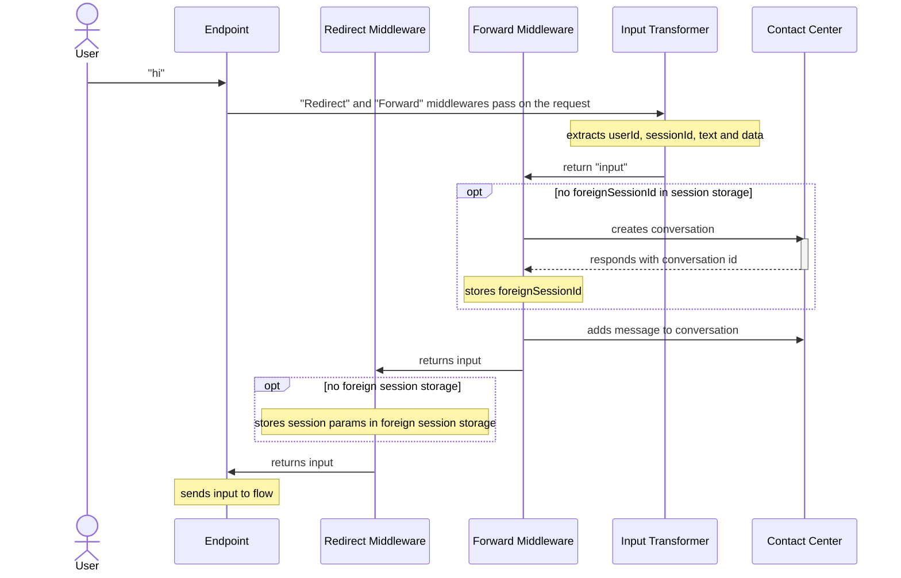
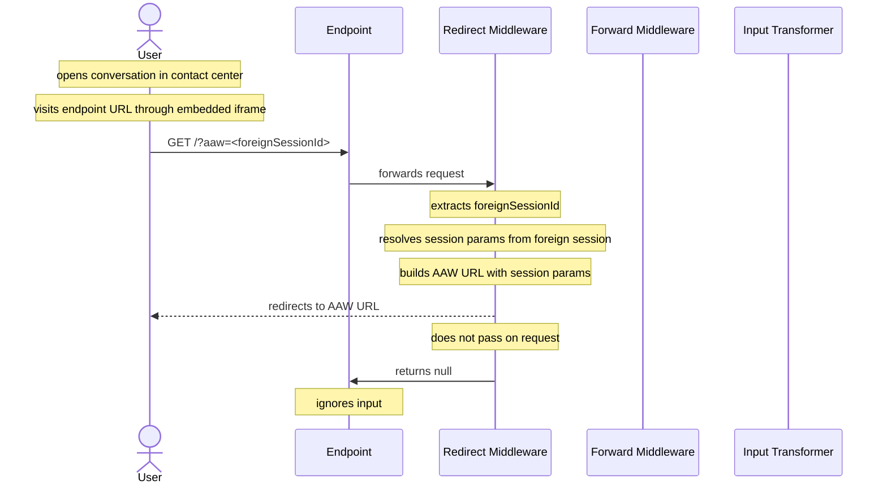

# Custom Handover AAW Redirect

## Setup

```javascript
/**
 * Insert "withAAWRedirect" code here
 */

/**
 * Insert "withForwardToCC" code here
 */

createWebhookTransformer({
  handleInput: withAAWRedirect(
    withForwardToCC(() => {
      // your regular "input transformer"
    })
  ),
});
```

## Handling / Forwarding User Inputs



## Handling AAW Redirects


