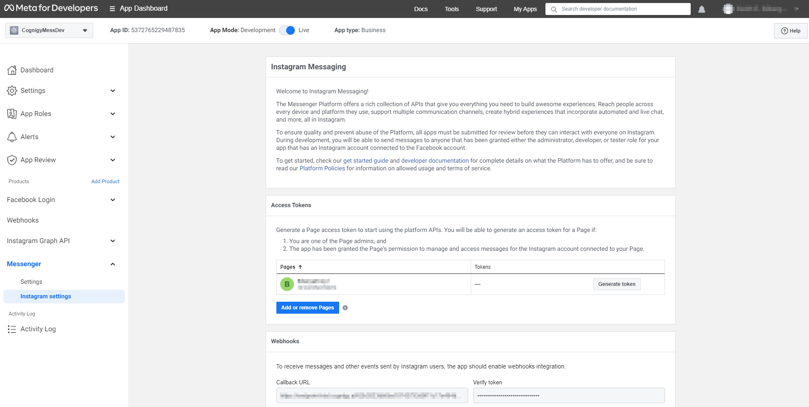
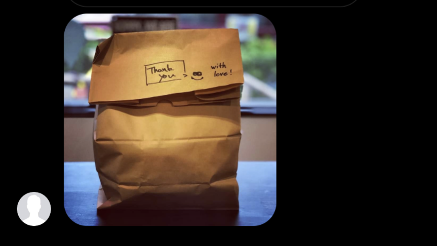
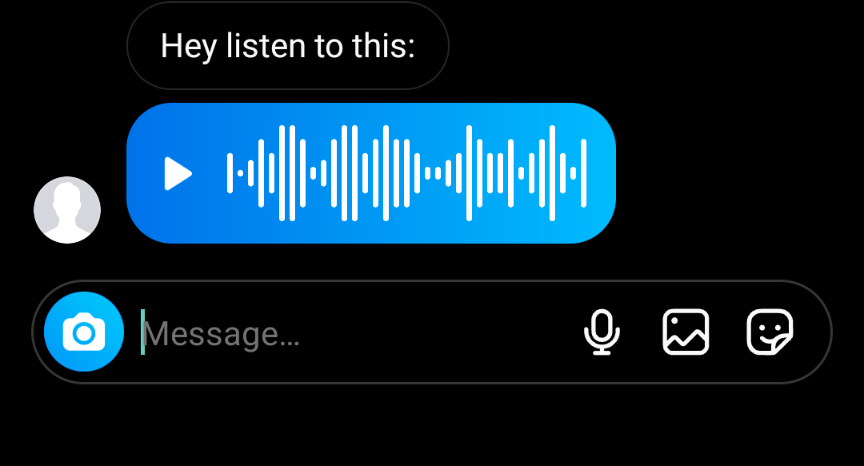
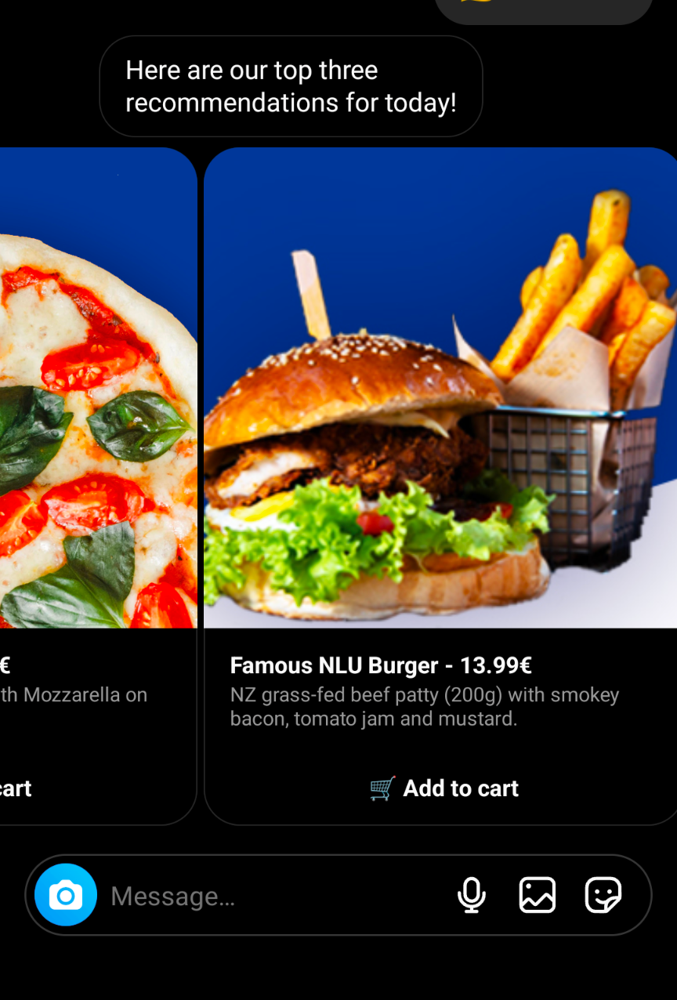
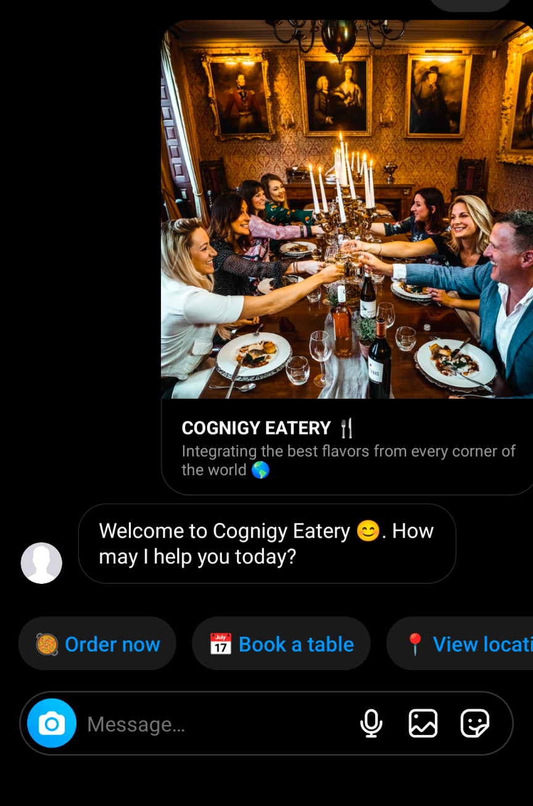
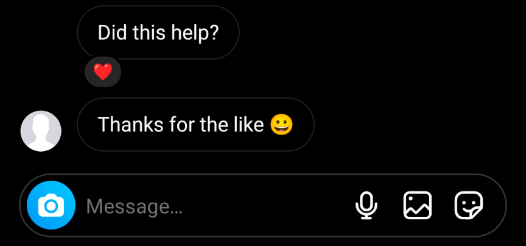
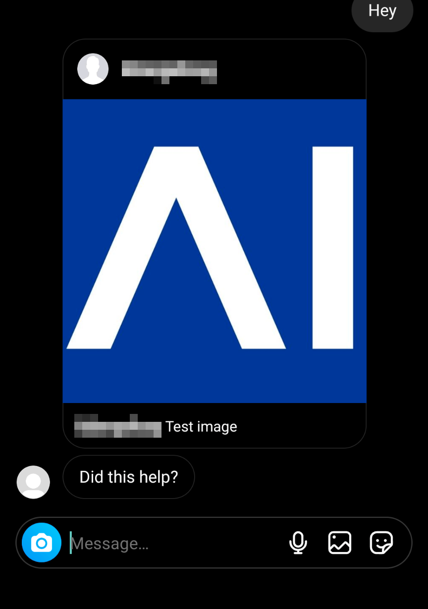
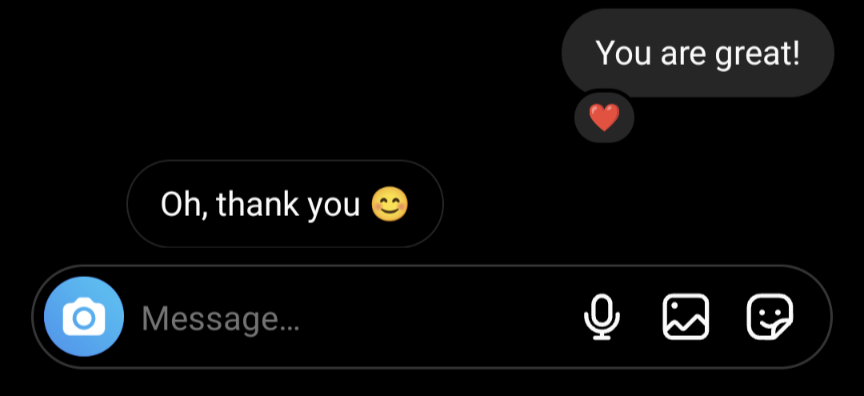
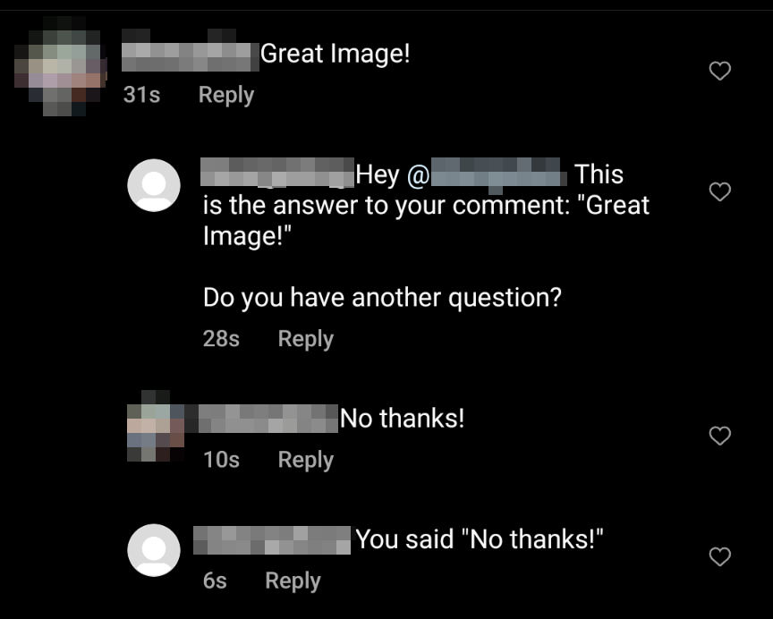

# Instagram
This Endpoint Transformer provides a native integration with Instagram.

It allows Cognigy to both answer direct messages as well as respond to comments on posts.

Please read this document for detailed information on the what needs to be considered when creating an Instagram endpoint. 
https://developers.facebook.com/docs/messenger-platform/instagram/

After completing an agent with this endpoint please look at this document for information in regards to what needs to be considered to have the bot be approved for publication by Instagram/Meta:
https://developers.facebook.com/docs/messenger-platform/instagram/app-review/apps-for-your-own-business
 

## Message Types

- Text
- Text with Quick Replies
- Image
- Video
- Audio
- Galleries
- Reactions
- Comment replies

## How to Setup

1. In order to create the required **Facebook Developer** Account and connect it to your instagram page, please read the official documentation here: https://developers.facebook.com/docs/messenger-platform/instagram/get-started 
2. Insert the Webhook URL from the Cognigy.AI Endpoint as "Webhook Callback-URL"
3. Define a `VERIFY_TOKEN` in the transformer.ts and insert the same value in the "Verification Token" field.
4. Find your the page ID for your Instagram webpage and add it to the `PAGE_ID` field.  
5. Create an access token in the developer portal and add it to the `ACCESS_TOKEN` field

## Messages from user
The user is able to send multiple types of messages including images, audio and video. What type of message you receive from the user can be seen in the `input.data.type` field of the `input` object.

For most media file types a download link for the media can be found in the `input.entry[0].messaging[0].message.attachments[0].payload` field.

## Message Types

### Text

The **Text** type is the default of the say node. 

### Media





You can send media such as **images**, **video** or **audio files**. 

### Gallery



The **Gallery** type of the say node can also be used. Images must be defined for each item.

### Quick Reply



Use the **Text with Quick Replies** to add quick type messages to the chat. The quick replies can either have a payload or a be a URL for external webpages. 

### Respond to Message Reactions



You can also see if the user reacted to your message and respond accordingly. 
Reactions can be recognized by the `reaction` value in the `input.data.type` field. 

### Posts/Data messages



You can also send other types of [media supported by Instagram](https://developers.facebook.com/docs/messenger-platform/instagram/features/send-message) by sending it as a data message, for example if you want to share an Instagram post in the replies. You just need to add a JSON object in the **Data** field of your output node. In this example we used data with the following JSON format. 

```json
{
    "type": "data",
    "message": {
        "attachment": {
            "type": "MEDIA_SHARE",
            "payload": {
                "id": "123456789123456789"
            }
        }
    }
}
```

**IMPORTANT** you must add the `{"type": "data"}` key value pair to the data unless it won't be recognized. 

### Reactions



It is also possible to react to a user's message by giving it a "like". To do this you could add the following to the data field of your say node:

```json
{
    "type": "reaction",
    "sender_action": "react",
    "payload": {
        "message_id": "{{input.data.entry[0].messaging[0].message.mid}}",
        "reaction": "love"
    }
}
```

To unreact to a message you can also add the following to the data:

```json
{
    "type": "reaction",
    "sender_action": "unreact",
    "payload": {
        "message_id": "{{input.data.entry[0].messaging[0].message.mid}}"
    }
}
```

The field `input.data.entry[0].messaging[0].message.mid` is where you can find the value with the message ID for the last message send by the user. 

**IMPORTANT** you must add the `{"type": "reaction"}` key value pair to the data unless it won't be recognized. 

### Comment responses



You can also respond to comments if you have them set up in your [Instagram Webhooks](https://developers.facebook.com/docs/graph-api/webhooks/getting-started/webhooks-for-instagram).

Only say nodes with simple text are currently supported in comments. 