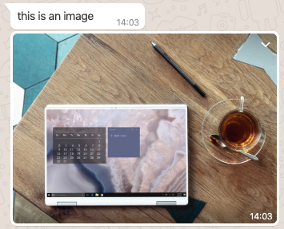

# Tyntec - WhatsApp


This [Transformer Function](https://docs.cognigy.com/docs/transformers) converts the Default content of your [Say Node](https://docs.cognigy.com/docs/say-nodes) to valid [WhatsApp](https://www.whatsapp.com/) messages. 

- [The same Transformer is available as REST version as well](../../rest/whatsapp)


## Provided Message Types

- [Tyntec - WhatsApp](#tyntec---whatsapp)
  - [Provided Message Types](#provided-message-types)
  - [Cognigy.AI Version 4](#cognigyai-version-4)
    - [Text](#text)
    - [Media Attachments](#media-attachments)
    - [Gallery](#gallery)
    - [Quick Reply](#quick-reply)
    - [Location](#location)

## Cognigy.AI Version 4

### Text

Use the **Text** type in the default tab of the SAY Node. 


### Media Attachments

One can use the default tab of the SAY Node and send, **images**, **videos** or **audio files**. An additonal description can be added by using the **Fallback Text**.



### Gallery

Use the **Gallery** type of the SAY Node.

**IMPORTANT**:
You have to define an image for each gallery item!


### Quick Reply

Use the **Text with Quick Replies** type of the SAY Node and define a **Quick Reply**.


**Note**: WhatsApp will display the quick replies as text messages with a trailing number, such as `1. first quick reply`. The user can either type in the number or the text of the quick reply to send it back to the AI.

### Location

Use the **Text** type of the SAY Node and define a data only message (No Text), where the data has to look like the following:

```json
{
  "location": {
    "longitude": -122.747986,
    "latitude": 37.989981,
    "name": "Your Location",
    "address": "Shoreline Highway, CA 1, California"
  }
}
```

This will be displayed like this:


## Cognigy.AI Version 3

### Text

Use the **Default** tab of the SAY Node. 


### Attachments

Use the **Webchat** tab of the SAY Node and define an **Attachment**. 


### Gallery

Use the **Webchat** tab of the SAY Node and define a **Gallery**.

**IMPORTANT**:
You have to define an image for each gallery item!


### Quick Reply

Use the **Webchat** tab of the SAY Node and define a **Quick Reply**.


**Note**: WhatsApp will display the quick replies as text messages with a trailing number, such as `1. first quick reply`. The user can either type in the number or the text of the quick reply to send it back to the AI.

### Location

Use the **Default** tab of the SAY Node and define a data only message (No Text), where the data has to look like the following:

```json
{
  "location": {
    "longitude": -122.747986,
    "latitude": 37.989981,
    "name": "Your Location",
    "address": "Shoreline Highway, CA 1, California"
  }
}
```

This will be displayed like this:


