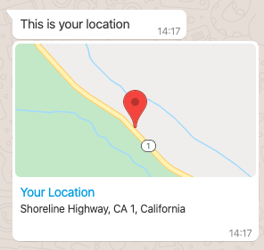

# Vonage - WhatsApp


This [Transformer Function](https://docs.cognigy.com/docs/transformers) converts the Default (Version 4) content of your [Say Node](https://docs.cognigy.com/docs/say-nodes) to valid [WhatsApp](https://www.whatsapp.com/) messages by using [Vonage](https://www.vonage.com/).

## Endpoint Configuration

In order to use this Transformer function, two settings need to be configured:

**Transformer Functions:**

Open the section, click on **Enable Input Transformer** and **Enable Output Transformer**. Finally, paste the entire [source code](./transformer.ts) into the dark code window.

**Basic Auth Credentials:**

The connection with Vonage is established using a basic authentication. Therefore, the following information needs to be provided:

- **User:** Vonage API Key
- **Password:** Vonage API Secret
- **Webhook:** https://messages-sandbox.nexmo.com/v0.1/messages

## Provided Message Types

- [Vonage - WhatsApp](#vonage---whatsapp)
  - [Provided Message Types](#provided-message-types)
    - [Text](#text)
    - [Media Attachments](#media-attachments)
    - [Location](#location)

### Text

Use the **Text** type in the default tab of the SAY Node. 


### Media Attachments

One can use the default tab of the SAY Node and send, **images**, **videos** or **audio files**. An additonal description can be added by using the **Fallback Text**.


### Location

Use the **Text** type of the SAY Node and define a data only message (No Text), where the data has to look like the following:

```json
{
  "location": {
    "longitude": -122.747986,
    "latitude": 37.989981,
    "name": "Your Location",
    "address": "Shoreline Highway, CA 1, California"
  }
}
```

This will be displayed like this:


