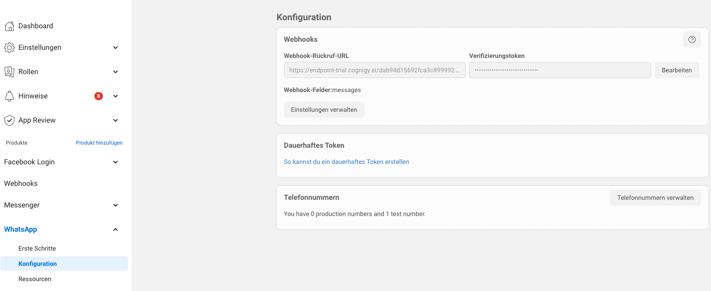

# WhatsApp

This Endpoint Transformer provides a native integration with WhatsApp.

# Message Types

- Text
- Text with Quick Replies
- Image
- Video
- Audio
- Document
- Contacts
- Location

# How to Setup

1. In order to create the required **Facebook Developer** Account and set up a WhatsApp Business account, please read the official documentation here: https://developers.facebook.com/docs/whatsapp/getting-started/signing-up
2. Inside of the Facebook Developer Portal, navigate to your App that should be connected to WhatsApp
3. In the left side menu, click on "WhatsApp" and then "Configuration":

4. Insert the Webhook URL from the Cognigy.AI Endpoint as "Webhook Callback-URL"
5. Define a `VERIFY_TOKEN` in the transformer.ts and insert the same value in the "Verification Token" field
