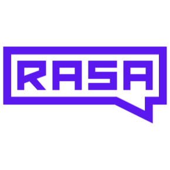

# Rasa NLU



This Transformer connects your Cognigy Code NLU Connector with your Rasa server\

## Functionality

We are using the `/model/parse` API endpoint, which means the Rasa server needs to be started with the ```--enable-api``` flag like so:

```rasa run --enable-api```

If the Transformer runs into an issue during the Rasa HTTP request it will be visible in the Debug section of the Cognigy Logs.

It will fill ```intent``` and ```intentScore``` in the Cognigy input object, which can be used like Cognigy values.
The mapped Rasa entities are directly transferred into "rasa" slots and are different from default Cognigy Slots.
